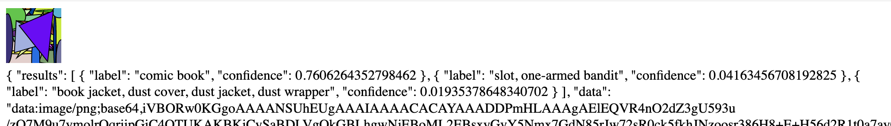

# recover-images-experiment
fiddling with recovering information about a model's training images by throwing examples at a classifier

https://repl.it/@kevinrobinson/phack
https://repl.it/@kevinrobinson/phack-teachable-machines
https://repl.it/@kevinrobinson/phack-viz

### things to try
if we generate all images and classify them, won't we find a few images that end up with high confidence since they happen to match the training set?  with small n models (like trained in the browser), this might happen a lot, where the model just memorizes each of the few examples.  with a small enough image space, could we recover the original images from the training set?

image spaces are so huge though, maybe we could try this with a toy example to show it's possible.  mnist is something like 20x20 pixels with on/off black and white colors, but that's still 2^400.  so i guess not practical but maybe possible to show with a toy.

one experiment might be doing this with models trained on known datasets - eg, take all the classes from mobilenet.  for each class, do google image search for top 20 pictures.  take each of those and bounce them off the classifier, and based on the results guess which one was more likely to be in the training set.  then look back at the known dataset and see if that was right.

or maybe start from a set of images you know match a class, and peturb each to get higher confidence within the same class.  like adversarial examples, but trying to find what's closest to the model' platonic form.
